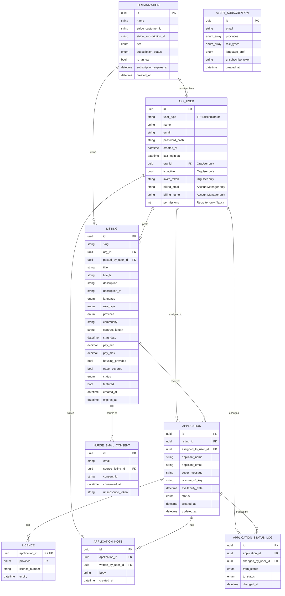
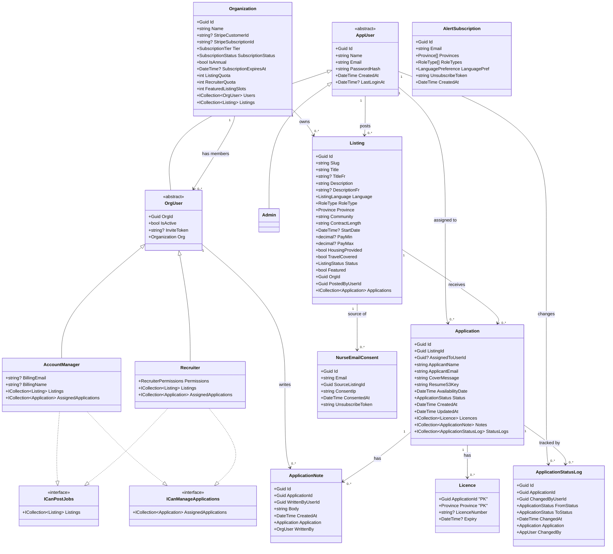

# NorthShift Jobs — ER & UML Diagrams

## ER Diagram

---

## UML Class Diagram

---

## Key Design Notes

| Decision | Rationale |
|---|---|
| TPH (single Users table) | One discriminator column, easy to query across user types, no joins for auth |
| Composite PK on Licence (ApplicationId + Province) | Enforces one licence per province per application at DB level |
| `OrgUser` abstract middle layer | Cleanly separates org-scoped users from Admin and future Nurse |
| `RecruiterPermissions` as flags enum | Granular, additive permissions without a full permission table |
| `AppUser` on StatusLog, `OrgUser` on Notes | Status can be changed by any internal user; notes are org-member only |
| Province as enum | Enforces valid Canadian province/territory codes at the type level |
